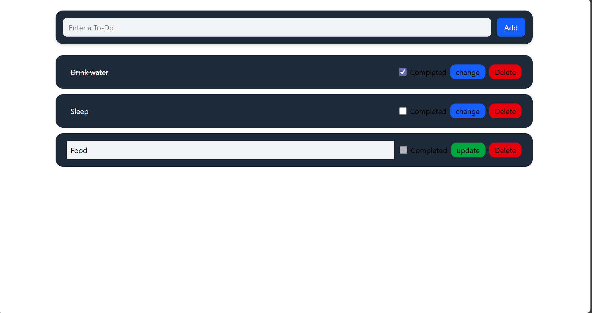

# 📝 Redux Todo App

# UI

A simple **Todo App** built with **React + Redux** for state management and styled using **TailwindCSS**.  
This project demonstrates how to use Redux actions, reducers, and hooks (`useDispatch`, `useSelector`) in a clean and scalable way.

---

## 🚀 Features
- Add new todos with a text input.
- Edit existing todos.
- Mark todos as **completed** with a checkbox.
- Delete todos.
- Clean and modern UI with TailwindCSS.

---

## 📂 Project Structure
src/

    ├── App.jsx    # Main app, connects Input & Display

    ├── index.jsx   # ReactDOM entry with Redux Provider

    ├── Store/

        │ ├── store.js # Redux store configuration

        │ ├── reducer.js # Reducer logic for todos

        │ └── action.js # Redux action creators & constants

    ├── Components/

        │ ├── Input.jsx # Todo input form

        │ └── Display2.jsx # Todo card (view, edit, delete)

        └── index.css # TailwindCSS styles

⚙️ How Redux Works in This Project

1. Actions (addAction, updateAction, deleteAction) are dispatched from components.

2. Reducer listens for these actions and updates the state (array of todos).

3. Store holds the todos state and makes it available to components via Provider.

4. Components use:

    useDispatch() → to send actions.

    useSelector() → to read todos from state.
📦 Tech Stack

1. React ⚛️
2. Redux 🔄
3. React-Redux🪝
4. TailwindCSS 🎨
5. Vite⚡
